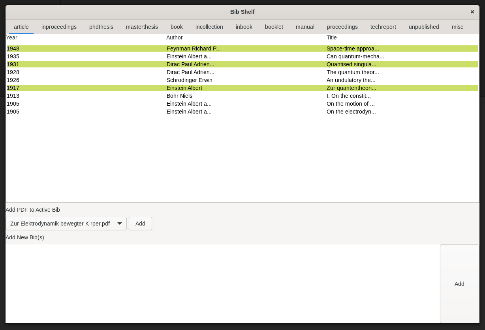

# Bib Shelf
GUI Application for Managing BibTeX Files



## Features
- Display the list of `.bib`
- Adding `.bib` with the input field
- PDF can be tied to `.bib`
- Click on `.bib` to open the tied PDF.

## Usage
### Run

```shell
cargo run
```

### Add `.bib`

- `cargo run`
- Write `.bib`(s) in the input box.
- Push lower Add button.

### Tie PDF to `.bib`
- Place PDFs in `pdf_pool/`.
- `cargo run`
- Select PDF to tie.
- Click `.bib` to tie.
- Push upper Add button.


## ToDo
- Refactoring......
- Coloring when PDFs are added during run.
- If the PDF is moved out of the `pdf_pool/`, it should be erased from `ComboBoxText`.
- Implement PDF drops.

## Reference
- [家計簿アプリを作ってみる ～gtk-rsでデスクトップアプリ開発をはじめよう［後編］](https://gihyo.jp/article/2023/07/rust-monthly-topics-04-03)